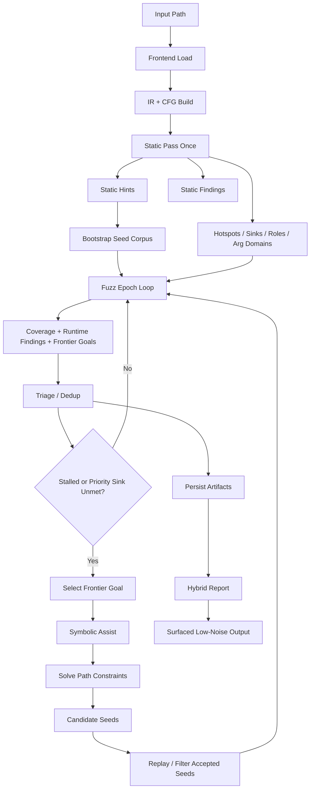

# Hybrid Approach Deep Dive

This document explains the current hybrid analyzer in this repository: what it is, how it works, why it exists, and where it is stronger than running the single approaches in isolation.

The implementation described here is the current **P1 hybrid**:

- static analysis runs once up front
- fuzzing is the primary exploration engine
- symbolic execution is used as a targeted assist when fuzzing stalls or misses a prioritized frontier
- findings are deduplicated, filtered, and persisted as one coordinated run

The main implementation points are:

- CLI entrypoint: `src/main.rs`
- hybrid scheduler: `src/core/scheduler/mod.rs`
- hybrid engine adapters: `src/core/engines/mod.rs`
- artifact model: `src/core/artifacts/mod.rs`
- finding triage: `src/core/triage/mod.rs`
- surfaced low-noise output: `src/surfaced/mod.rs`
- persisted run artifacts: `src/core/store/mod.rs`

## What The Hybrid Approach Is

The hybrid mode is not a raw union of:

- static findings
- symbolic findings
- fuzzing findings

Instead, it is a **coordinated control loop** that uses each engine for the part it is best at:

- static analysis supplies cheap global structure and guidance
- fuzzing supplies concrete execution, coverage growth, and runtime evidence
- symbolic execution is only pulled in when the fuzzing loop needs help reaching a specific uncovered edge or sink

That distinction matters. A naive union gives you more output, but not necessarily more signal. The current hybrid is designed to produce:

- better runtime recall than fuzzing alone on hard-to-reach paths
- better practical precision than “run everything and merge everything”
- stronger reproducibility because findings and assists are attached to seeds, coverage, and run artifacts

## High-Level Flow

## Why The Single Approaches Are Not Enough

### Static

Static is cheap and broad. It is good at:

- whole-program structure
- quick sink discovery
- access patterns
- taint and callgraph guidance
- finding many issues with very low runtime cost

Static is weak when the question is:

- can this path actually execute?
- under what concrete sender/value/environment?
- is this runtime consequence reachable or just structurally possible?

So static alone tends to be the widest and cheapest mode, but also the one most likely to over-report generic possibilities.

### Symbolic

Symbolic is good at:

- solving path constraints
- steering into hard branches
- recovering narrow missed paths
- reasoning about values that fuzzing may not guess quickly

Symbolic is weak when used as the only engine because:

- it is expensive
- path explosion is real
- it often needs careful prioritization to stay useful
- it can spend too much time proving or disproving paths that fuzzing would hit cheaply

So symbolic alone is powerful, but it is not the best default exploration engine for broad contract traversal.

### Fuzzing

Fuzzing is good at:

- concrete runtime evidence
- sequence execution
- coverage growth
- fast validation of many input variants

Fuzzing is weak when:

- a critical branch needs very specific values
- a rare path sits behind hard guards
- the engine needs value synthesis rather than mutation

So fuzzing alone is usually more realistic than static and cheaper than symbolic, but it can plateau.

## What Hybrid Does Better

The hybrid approach exists to combine the strengths above while avoiding their worst failure modes.

It excels at:

1. **Getting runtime evidence with guidance**
   Static runs first and produces hints. Fuzzing does not start blind.

2. **Using symbolic execution only where it is worth the cost**
   Symbolic is not the default engine in the loop. It is an assist engine.

3. **Recovering hard paths without turning the whole run into a symbolic job**
   The scheduler only asks symbolic execution to target frontier goals when fuzzing stalls or a prioritized sink remains uncovered.

4. **Keeping one artifact trail**
   Coverage, seed corpus, assists, findings, and report are saved under one run directory.

5. **Reducing output inflation**
   The hybrid scheduler, triage, and surfaced-output layer all work to avoid “same root cause emitted ten different ways”.

In practical terms, hybrid is the mode that is supposed to feel like:

- more grounded than static
- more scalable than symbolic
- more complete than fuzzing

## Current Control Loop In Detail

### 1. Frontend, IR, and CFG Setup

Hybrid starts the same way as the other modes:

- load the target with the frontend
- lower the normalized AST into IR
- build CFGs from the IR

This happens in `run_with_output(...)` inside `src/core/scheduler/mod.rs`.

That shared frontend matters because hybrid is not a separate parsing pipeline. It reuses the same normalized program model as the other engines.

### 2. Static Analysis Runs Once

The scheduler calls the static adapter first:

- `StaticAdapter::analyze(...)`

This produces `StaticHints`, which include:

- function whitelist / blacklist
- hotspots
- sinks
- callgraph summary
- taint summary
- storage read/write mapping
- argument-domain hints
- address-role hints

These hints live in `src/core/artifacts/mod.rs` and are filled in `src/core/engines/mod.rs`.

This is one of the most important hybrid design choices: static is used as a **planner and guide**, not only as a finding source.

### 3. Static and Meta Findings Enter The Same Triage Pipeline

After hints are created, the scheduler also ingests:

- static findings
- meta findings
- runtime meta promotions

The scheduler does not just print these directly. It pushes them into `FindingTriage` in `src/core/triage/mod.rs`.

That gives hybrid an early shared dedup layer instead of independent per-engine printouts.

### 4. Seed Corpus Bootstrap

Hybrid then builds an initial seed corpus from:

- public entrypoints
- static guidance
- address-role hints
- argument-domain hints

This happens in `bootstrap_seeds(...)` in `src/core/scheduler/mod.rs`.

This is another place where hybrid differs from plain fuzzing. The fuzzing loop is not seeded randomly from scratch if the static pass already knows:

- which functions are worth hitting
- which parameters probably want deadline-like or owner-like values
- which senders are likely to matter

### 5. Fuzzing Is The Main Exploration Engine

Each epoch calls:

- `FuzzAdapter::run_epoch(...)`

The fuzz adapter:

- extracts ABI and dependencies
- configures the fuzz loop
- converts the current seed queue into individuals
- applies static guidance to those individuals
- executes individuals concretely
- tracks coverage and edge growth
- emits runtime findings from the fuzzing oracle
- emits frontier goals for still-uncovered high-value targets
- returns a best trace prefix that represents a useful near-miss or finding-producing path

This is the center of the hybrid system. The hybrid is fundamentally **fuzz-first**.

### 6. Coverage, Frontier, and Stall Metrics Drive The Next Decision

Each epoch returns:

- coverage summary
- new seeds
- findings
- stall metrics
- candidate frontier goals
- optional trace prefix

The scheduler then:

- updates global block and edge coverage
- pushes new seeds
- pushes frontier goals
- drains findings into triage

The scheduler separately tracks:

- stagnant epochs
- windowed edge-rate history
- whether priority sinks remain uncovered

This is what turns the hybrid into a control system rather than just “fuzz then symbolic”.

### 7. Symbolic Execution Is Triggered Only On Need

The current trigger is roughly:

- fuzzing has stalled, or
- a high-priority sink is still unmet

When that happens, the scheduler selects a frontier goal with:

- backoff
- per-goal attempt budgeting
- priority ordering

That selection logic lives in `select_frontier_goal_for_assist(...)` in `src/core/scheduler/mod.rs`.

This is one of the main reasons hybrid is more practical than always running symbolic in parallel from the start:

- symbolic budget is spent on uncovered goals
- repeated failures get backed off
- already exhausted goals are not hammered forever

### 8. Symbolic Assist Solves For A Target, Not For Everything

The symbolic side in hybrid is implemented by:

- `SymbolicAssistAdapter::solve(...)`

This assist engine:

- finds the CFG function for the selected goal
- translates the goal into a target block or target edge
- symbolically explores states from the function entry
- checks feasibility with Z3
- solves satisfying states into concrete seeds

The output is:

- new candidate seeds
- solver statistics

The important point is that hybrid symbolic execution is **goal-directed**. It is not trying to enumerate every interesting path in the whole contract.

### 9. SE Seeds Must Survive Replay Before They Are Trusted

Candidate seeds returned by symbolic execution are not injected blindly.

The scheduler replays them concretely and keeps them only if they:

- unlock new edges, or
- improve distance to the selected frontier

This happens in `filter_assist_seeds(...)` in `src/core/scheduler/mod.rs`.

That replay-and-filter step is one of the biggest reasons the hybrid approach is stronger than a naive symbolic-to-fuzz handoff:

- it rejects symbolic results that do not actually help the concrete search
- it keeps the seed queue focused
- it measures success in coverage or frontier progress, not just satisfiability

### 10. All Findings Go Through Triage

Hybrid uses `FindingTriage` as the central dedup layer.

Its current behavior:

- counts every finding seen
- keeps a signature-indexed unique set
- prefers the shortest reproducer when duplicates collide

The signature includes:

- engine
- analysis layer
- evidence kind
- finding type
- location fields
- optional revert hash

This means hybrid does not collapse everything across engines into one blob. It keeps distinct evidence when that distinction still matters, but prevents simple repetition from dominating output.

### 11. Artifacts Are Persisted For The Whole Run

Hybrid writes a run directory under `runs/<run_id>/` through `ArtifactStore`.

Saved artifacts include:

- `target.json`
- `static_hints.json`
- `seed_corpus.json`
- `findings.json`
- `coverage_history.json`
- `epochs.json`
- `se_assists.json`
- `report.json`

This is an important operational advantage over single-mode terminal output: hybrid produces a complete run record rather than just a final screen of findings.

### 12. Final Output Is Surfaced, Not Raw

After the scheduler returns, `src/main.rs` splits hybrid findings into:

- runtime findings
- meta findings

Then the surfaced-output layer:

- canonicalizes kind names
- deduplicates
- suppresses low-signal findings in contexts where stronger findings exist
- hides taxonomy-completion meta noise when runtime coverage already exists

That is why the current hybrid CLI and JSON are much cleaner than earlier raw benchmark-era output.

## Why Hybrid Is Better Than A Raw Union

The most common misunderstanding is:

> hybrid = static findings + symbolic findings + fuzzing findings

That would be easy to implement, but it would be the wrong design for this tool.

The current hybrid is better because it uses:

- **static** for guidance
- **fuzzing** for exploration
- **symbolic** for targeted unlocks
- **triage** for dedup
- **surfacing** for low-noise presentation

A raw union would:

- overcount related symptoms
- mix meta and runtime evidence too loosely
- over-reward broad detectors
- be harder to reproduce and interpret

The current design tries to preserve the useful parts of multi-engine cooperation without turning output into an uncurated pile of findings.

## Where Hybrid Excels Compared To Each Single Mode

### Versus Static

Hybrid is better when:

- reachability matters
- transaction ordering matters
- concrete sender/value/environment matters
- you want reproduction seeds

Static is still better when:

- you want the fastest broad scan
- you care more about structural suspicion than runtime confirmation

### Versus Symbolic

Hybrid is better when:

- total runtime matters
- wide input exploration matters
- many branches are easy to hit concretely
- you want symbolic budget spent only on hard frontiers

Symbolic is still better when:

- the target path is constraint-heavy from the start
- you need pure path reasoning more than broad runtime exploration

### Versus Fuzzing

Hybrid is better when:

- fuzzing plateaus on a guarded branch
- mutations are not enough to synthesize the needed inputs
- you need a solver to manufacture a path-opening seed

Fuzzing is still better when:

- you want the simplest concrete runtime loop
- the target is mutation-friendly and does not need solver help

## Practical Strengths Of The Current Hybrid

In the current implementation, hybrid’s strongest properties are:

- **guided fuzzing instead of blind fuzzing**
- **edge/frontier-aware symbolic assists**
- **artifact-rich runs**
- **centralized dedup**
- **clean surfaced output**

This is why hybrid is usually the best “balanced operator mode” in the project:

- it is not the cheapest
- it is not the most exhaustive symbolic reasoner
- it is not the broadest raw emitter
- but it is the most deliberate orchestration of the available engines

## Current Limits

This is still the **P1** hybrid, not the final P4 architecture.

Important current limits:

1. **Single-process coordination**
   The scheduler is still one coordinator loop, not a parallel worker system.

2. **Symbolic is assist-only**
   That is intentional, but it also means some purely symbolic opportunities may wait behind the fuzz loop.

3. **Quality depends on guidance quality**
   If sinks, hotspots, or domains are weak, hybrid loses some of its targeting advantage.

4. **Artifacts are persisted, but orchestration is not distributed**
   The schema is ready for more advanced queue backends, but the live runtime is still in-memory P1.

## When To Prefer Hybrid

Choose `--hybrid` when you want:

- one main mode for serious contract analysis
- runtime evidence, not only structural suspicion
- solver help without paying full symbolic cost everywhere
- better output discipline than a raw multi-engine merge

Choose a single mode instead when:

- `--static`: you need the fastest first pass
- `--symbolic`: you are investigating a very specific hard path
- `--fuzzing`: you want a simpler concrete execution campaign

## Short Mental Model

If you need a compact description of the current hybrid approach, it is this:

> Run static once to build a map.  
> Let fuzzing drive the search.  
> Call symbolic execution only when the search gets stuck near something important.  
> Accept only the symbolic results that improve the concrete campaign.  
> Deduplicate and surface the final output as one coherent run.

That is the core reason the hybrid mode is stronger than any single mode by itself and also better than a naive multi-engine union.
